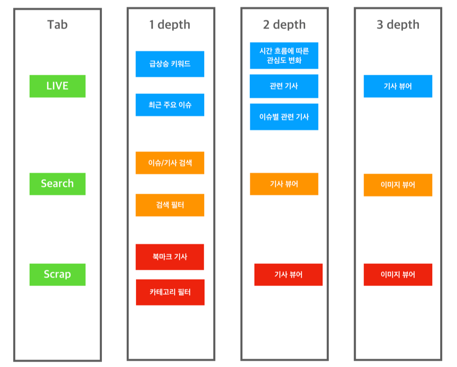
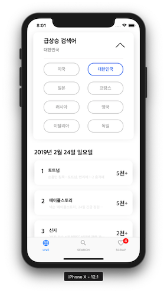
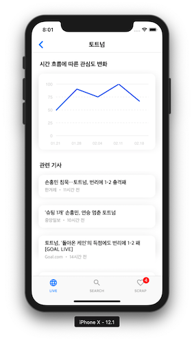
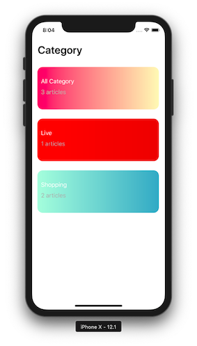

<<<<<<< HEAD
=======
# tŕee
> 전 세계 이슈(급상승 검색어, 뉴스 기사)를 실시간으로 제공하는 애플리케이션

## 개발 기간
> 2019.01.21 - 2019.02.22

## Team Gardener
> BoostCamp 3th A-1 Team
- tutor : yagom 
- [박성준](https://github.com/godpp) 
- [김혜리](https://github.com/kimhyeri) 
- [김현태](https://github.com/onemoongit)

## 주요 기술
- HTTP Networking Library - [Booster](https://github.com/godpp/Booster)
- Image Caching
- CoreData
- Siri Shortcuts

## 👨‍🏫 Tutoring Log

* [Week1](https://github.com/boostcamp3-iOS/team-a1/wiki/Week1)
* [Week2](https://github.com/boostcamp3-iOS/team-a1/wiki/Week2)
* [Week3](https://github.com/boostcamp3-iOS/team-a1/wiki/Week3)
* [Week4](https://github.com/boostcamp3-iOS/team-a1/wiki/Week4)

## 📝 Assignment

* [Week1](https://github.com/boostcamp3-iOS/team-a1/wiki/Week1-Assignment)
* [Week2](https://github.com/boostcamp3-iOS/team-a1/wiki/Week2-Assignment)
* [Week3](https://github.com/boostcamp3-iOS/team-a1/wiki/Week3-Assignment)

## GROUND RULE

* 공통된 코드 컨벤션을 사용합니다.
  - [Wiki](https://github.com/boostcamp3-iOS/team-a1/wiki/Swift-Style-Guide)에 정의하였습니다.
* 코드의 효율성을 증대시킵니다.
  - 재사용 가능한 부분에 대해서는 모듈로 활용하여 사용합니다.
  - PR에 대한 코멘트를 활용하여 서로의 코드를 적극적으로 리뷰합니다.
* 대화를 통한 적극적인 피드백을 주고받습니다.
  - 매일 아침 10시부터 데일리 스크럼을 통해 어제 한 작업을 공유하고 오늘 해야할 작업을 명확하게 설정합니다.

## 기능 트리

## 구성 화면 

> LIVE

- 각 나라별 급상승 검색어가 날짜순으로 나열되고 확인할 수 있습니다.

- 그래프를 통해서 사람들의 관심도가 시간에 따라서 어떻게 달라지는지 확인할 수 있습니다.

- 카테고리별로 전세계 주요 이슈들을 확인할 수 있습니다.

> SEARCH

- 자신이 원하는 키워드를 검색할 수 있습니다.

- 필터를 통해서 원하는 카테고리 내용 언어 등을 설정하여 검색이 가능합니다.

> SCRAP

- Live & Search 탭에서 자신이 스크랩한 기사들을 확인할 수 있습니다. 

- 네트워크가 없더라도 언제 어디서나 기사들을 확인하고 읽을 수 있습니다.

>>>>>>> develop

